  <table border="0">
    <tr>
      <td width="38%" align="center" valign="top">
        
      </td>
      <td width="62%" align="left" valign="top">
        

          <!-- WakaTime Coding Activity Badge -->
          
          &nbsp;
          <!-- Profile Views Counter -->
           
          &nbsp;
          <!-- Indian Flag -->
          
        

        <h2>🌌 Welcome to My Digital Realm 🌌</h2>
        <h3>🚀 About Me</h3>
        
Greetings, fellow digital explorer! Step into my world of bytes and algorithms:

        <ul>
          <li>🎓 <b>Education</b>: BTech student at Parul University</li>
          <li>🖥️ <b>Major</b>: Computer Science & Engineering</li>
          <li>🔬 <b>Specializations</b>:
            <ul>
              <li>🕶️ Lens Creation</li>
              <li>🛡️ Ethical Hacking</li>
              <li>🌐 Web Development</li>
              <li>🔐 Cybersecurity</li>
            </ul>
          </li>
        </ul>
      </td>
    </tr>
  </table>

 

  

 

## 🌍 **Socials**:

  <table>
    <tr>
      <td>
        
      </td>
      <td>
        
      </td>
      <td>
        
      </td>
      <td>
        
      </td>
      <td>
        
      </td>
      <td>
        
      </td>
      <td>
        
      </td>
    </tr>
  </table>

---

# 💻 Tech Stack

| Frontend | Backend | DevOps & Tools | Deployment & Hosting | Design Tools |
|:--------:|:-------:|:---------------:|:---------------------:|:------------:|
|  |  |  |  |  |
|  |  |  |  |  |
|  |  |  |  |  |
|  |  |  |  |  |

---

# 📊 **GitHub Contributions**

  
  
  
    

  

    
  
  

    
<h3>🧩 Most Used Languages</h3>

     
    

      
    

  

---

  <h3>Show some ❤️ by starring my repositories!</h3>

  

